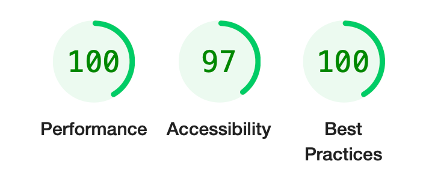

## Live at

> [hackillinois-schedule.vercel.app](https://hackillinois-schedule.vercel.app/)

This is a [Next.js](https://nextjs.org/) project bootstrapped with [`create-next-app`](https://github.com/vercel/next.js/tree/canary/packages/create-next-app).

## Run locally

Install and run dev server

```bash
npm install && npm run dev
# or
yarn install && yarn dev
# or
pnpm install && pnpm dev
```

Open [http://localhost:3000](http://localhost:3000) with your browser to see the result.

## Lighthouse



Full performance overview in [lighthouse.pdf](https://github.com/Jish2/hackillinois24-web/blob/main/lighthouse.pdf)
